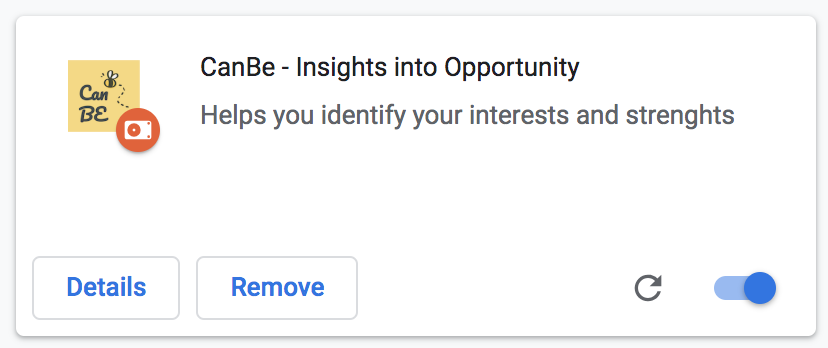

# CanBe - Insights into opportunity

Chrome extension to help people to understanding their skills and interests better.
You can find more information on the [Devpost page](https://devpost.com/software/can-be-no7pjg).

  

We made [a short video](https://www.youtube.com/watch?v=4eU6Y-v9o4I) about the project.

## Run

1. Type `chrome://extensions/` into the address bar of Chrome.
2. On the right hand side of the upcoming screen, toggle the switch to **developer mode**.
3. Click on the **Load unpacked** button.
4. Select the `build` folder of this project.
5. The project should now be visible like this (with and additional `ID` in developer mode):

  

## Development

1. Change code
2. Run `yarn build` (or `npm run build`)
3. Inside `chrome://extensions/` in Chrome, hit the round arrow to update the code.
4. To debug, right click on the extension icon in the upper bar of Chrome and select **Inspect** to debug this special window and e.g. see its `console.log` messages.

---

This project was bootstrapped with [Create React App](https://github.com/facebook/create-react-app). You can learn more in the [Create React App documentation](https://facebook.github.io/create-react-app/docs/getting-started).
